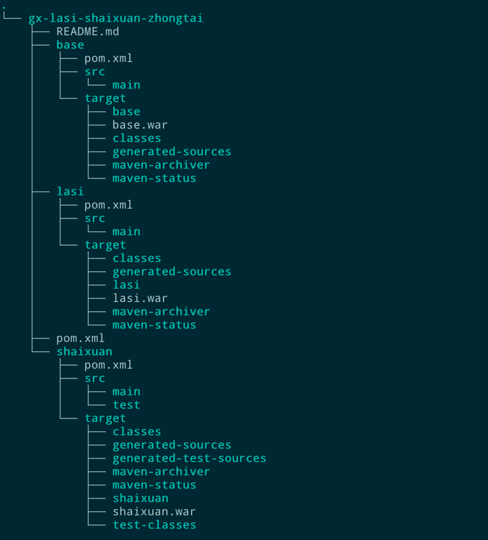

## Project Description
> This project aim to make a platform to migrate project written in C# (even VB) to Java

## System Architecture

> All dependencies are managed by the parent project's pom if you want to see more details.
### dependency version
| dependency        | Version |
| ----------------- | ------- |
| spring-boot       | 2.7.8   |
| maven             | 3.8.7   |
| mybatis-plus      | 3.5.1   |
| junit             | 3.8.1   |
| java              | 1.8     |
| sql server driver | 8.4.1   |
| commons-io        | 1.9     |

